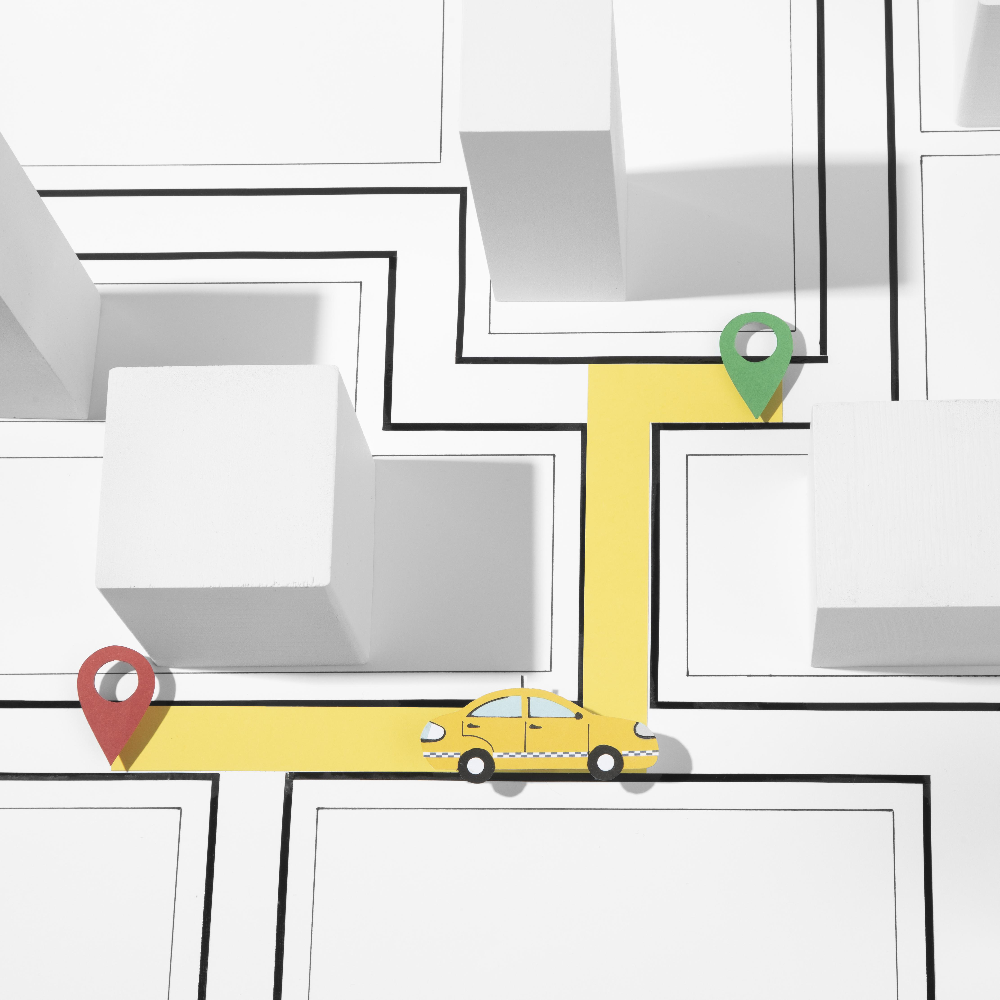
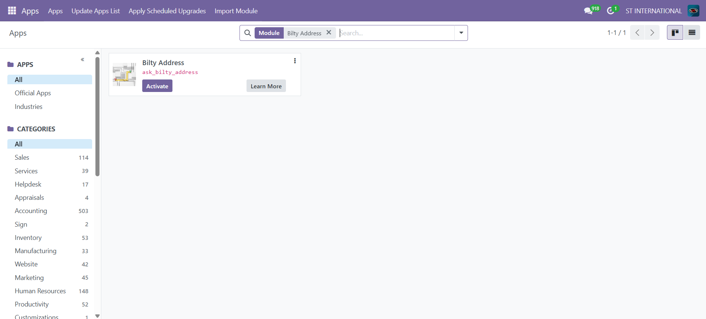
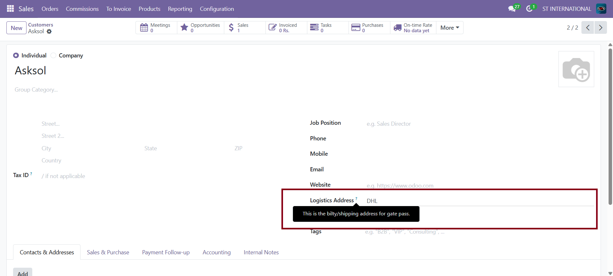
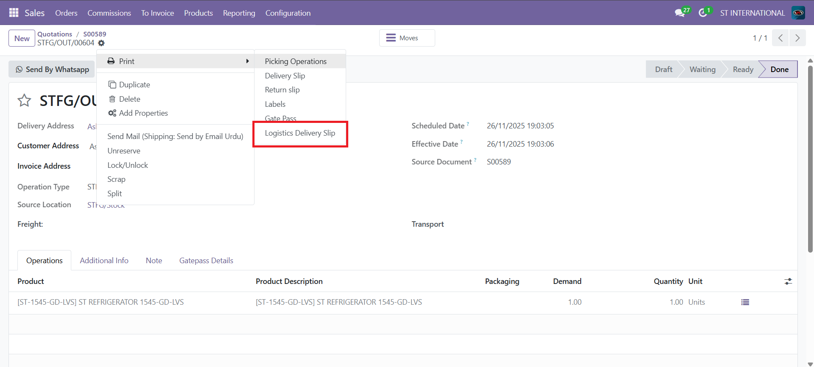
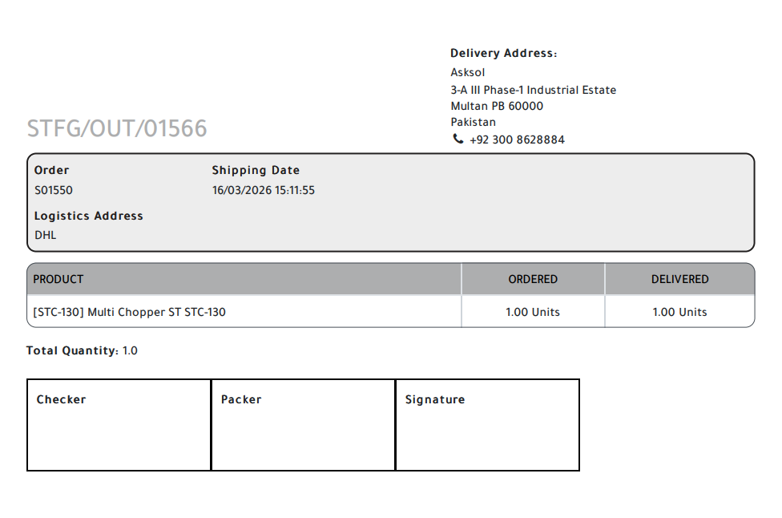

# Bilty Address Report  

  
**by [ASKSOL](https://www.asksol.pk)**

## 🚚 Complete Bilty Address Management — Inside Odoo

Customer forms, print reports, delivery slips. **Everywhere you need it.**

[](ask_bilty_address/static/description/assets/screenshots/1.png)

### Key Highlights

| Feature | Description |
|---------|-------------|
| 🏢 **Logistics Address on Customer Form** | Add complete bilty/logistics address directly on customer/partner form (multi-line supported). |
| 🖨️ **One-Click Print Actions** | Print bilty address report from customer form, delivery order, or dedicated menu. |
| 📄 **Delivery Slip Integration** | Bilty address automatically appears on delivery slips & logistics reports. |

## 📸 Screenshots

### 1. Partner Form - Bilty Field
  
**Multi-line Bilty Address field** on every customer/partner form after Website field.

### 2. Delivery Order Print Action
  
**Print → Logistics Delivery Slip** from outgoing shipment.

### 3. Dedicated Report Menu
  
**Logistics Delivery Slip** menu with enhanced layout.

### 4. Professional PDF Output
  
**Gate pass ready** with bilty address, totals, signatures.

## ✨ Features

<details>
<summary>Click to expand full feature list (12+ features)</summary>

- ✅ **Odoo 18 Community Edition** - Fully tested, compatible with sale/stock/sale_management
- ✅ **Bilty Address Field** on res.partner (multi-line rich text, positioned after Website)
- ✅ **Delivery Slip Integration** - Auto-displays on Logistics Delivery Slip prints
- ✅ **One-Click Print** from stock.picking: Action → Print → Logistics Delivery Slip
- ✅ **Dedicated Report Menu** - Logistics Delivery Slip with totals & signatures
- ✅ **Professional PDF Layout** - Bilty address prominent, qty totals, bordered signature boxes
- ✅ **Multi-line Address Support** - Street, city, province, contact in single field
- ✅ **Gate Pass Ready** - Pakistani transport document standards (checker/packer/signatures)
- ✅ **Auto-Populate Everywhere** - Partner bilty pulls to all delivery documents consistently
- ✅ **Multi-Company Aware** - Respects company context across operations
- ✅ **100% Safe** - Extends existing models/views only (no new tables/migrations)
- ✅ **Lightweight & Fast** - Minimal code, no performance impact

</details>

## 🚀 Installation

1. **Clone/Download** this repository to your Odoo addons path:
   ```
   git clone https://github.com/YOUR-REPO/ask_bilty_address.git /path/to/odoo/addons/
   ```

2. **Restart Odoo** server (`sudo service odoo restart` or via UI)

3. **Update Apps List** (Apps → Update Apps List)

4. **Install "Bilty Address"** module (search "Bilty" or "ASKSOL")

Dependencies: `base`, `sale`, `stock`, `sale_management`

## 📖 Usage

### 1. Add Bilty Address to Partner
- Open any **Customer/Partner** form
- Scroll to **Bilty Address** field (after Website)
- Enter complete logistics address (supports formatting)

### 2. Print from Delivery Order
- Open **Delivery Order** (Outgoing)
- **Action → Print → Logistics Delivery Slip**
- Bilty address auto-populates from partner

### 3. Bulk Print via Menu
- Navigate to **Logistics Delivery Slip** report menu
- Select pickings, print enhanced report

## ❓ Frequently Asked Questions

<details>
<summary>Q: Which Odoo version?</summary>
**Odoo 18 Community Edition**. Built for latest Community (not Enterprise or v16/17).
</details>

<details>
<summary>Q: Where is Bilty field?</summary>
Every **Customer/Partner form** after Website field. Multi-line rich text.
</details>

<details>
<summary>Q: How to print?</summary>
**Delivery Order**: Action → Print → Logistics Delivery Slip. Auto-fills bilty.
</details>

<details>
<summary>Q: Dedicated menu?</summary>
Yes - **Logistics Delivery Slip** for bulk print with totals/signatures.
</details>

<details>
<summary>Q: PDF includes what?</summary>
Prominent bilty address, total quantity, checker/packer/signature boxes.
</details>

<details>
<summary>Q: Production safe?</summary>
✅ **Extends existing** partner/delivery views only. No new tables or data changes.
</details>

## 📞 Support & Contact

| Contact | Details |
|---------|---------|
| 🔔 **Email** | [Roshaan@asksol.pk](mailto:Roshaan@asksol.pk) |
| 📱 **WhatsApp** | [+92 300 8628884](https://wa.me/923008628884) |
| 🌐 **Website** | [www.asksol.pk](https://www.asksol.pk) |

**ASKSOL Services**: Odoo Customization • Implementation • Support • Migration • Integration

## 📄 Module Info

| Info | Details |
|------|---------|
| **Version** | 18.0.1.0 |
| **License** | LGPL-3 |
| **Category** | Sale |
| **Dependencies** | `base`, `sale`, `stock`, `sale_management` |

**Live Demo**: [View on Odoo Apps](ask_bilty_address/static/description/index.html)

---

⭐ **Made with ❤️ by ASKSOL** | [Odoo Gold Partner](https://www.asksol.pk)

